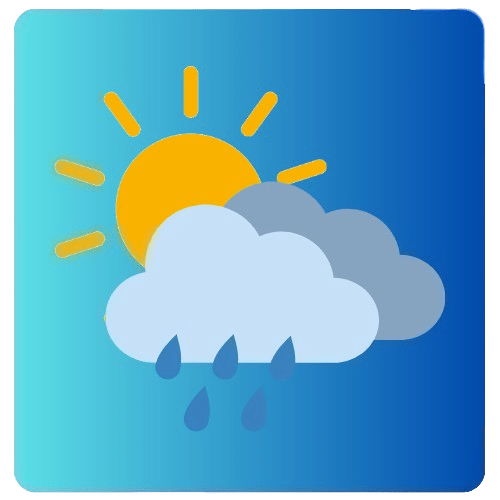
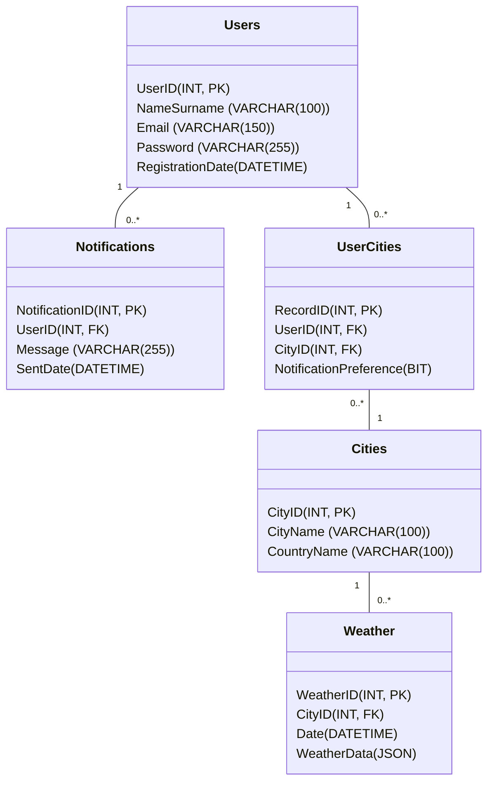

# Weather Plus Zero
> Windows platformları için uygun, C# dilinde basit ve kullanışlı hava durumu uygulaması.

## Genel 🙌

Weather Plus Zero, modern ve kullanıcı dostu bir hava durumu uygulamasıdır. Weather Plus Zero, Windows işletim sistemleri için tasarlanmış, C# programlama dili kullanılarak geliştirilmiş kapsamlı bir hava durumu uygulamasıdır. Kullanıcıların günlük hayatlarını planlamalarına yardımcı olmak için tasarlanmıştır.

## Özellikler ⭐

**Ana Özellikler:**

- Anlık hava durumu bilgileri.
- Saatlik ve günlük tahminler.
- Sıcaklık, nem, rüzgar hızı ve yön bilgileri.
- Görsel hava durumu göstergeleri.
- Çoklu şehir desteği.
- Bildirim sistemi.

**Teknik Özellikler:**

- Windows uyumlu modern arayüz.
- Hızlı ve optimize edilmiş performans.
- Gerçek zamanlı veri güncellemeleri.
- Düşük sistem kaynağı kullanımı.

**Hedef Kitle:**

- Günlük hava durumu takibi yapan kullanıcılar.
- Profesyonel planlamacılar.
- Outdoor aktivite tutkunları.
- Hava durumuna bağlı çalışan profesyoneller.

**Kullanıcı Deneyimi:**

Uygulama, kullanıcı dostu arayüzü ve sezgisel tasarımı ile her yaştan kullanıcının kolayca kullanabileceği şekilde tasarlanmıştır. Minimal ve modern tasarım anlayışı, kullanıcılara kesintisiz bir deneyim sunar.

## GitHub ⛓️‍💥

[Weather Plus Zero GitHub Repo](https://github.com/EnesEfeTokta/WeatherPlusZero)

## Drawio 🪢
[Weather Plus Zero Drawio](https://github.com/EnesEfeTokta/WeatherPlusZero/blob/main/WeatherPlusZero/Planning/WeatherPlusZero.drawio)

## Proje Dallanması

## İletişim ☎️

- [enesefetokta009@gmail.com](mailto:enesefetokta009@gmail.com)
- (+90) 541 586 9564
- https://www.linkedin.com/in/enes-efe-tokta-6567151b5/
- https://github.com/EnesEfeTokta

## Logo ve Görseller 🖼️

## Kaynaklar ➕

### Görseller
- None

## Görevler 📝

[Görevler](https://www.notion.so/1531fb14c4a880c29cd1e8274f998d62?pvs=21)

## Proje Planlama ve Tasarım 🎨

Gösterilecek olan verileri:

- Sıcaklık (Fahrenheit ve Celsius cinsinden…),
- Nem,
- Rüzgar,
- Yağış

Eş zamanlı olarak takip edilecek şehir sayısı en fazla üç adet olunabilecek.

Bildirim sistemi stabil olarak her 5 saatte bir hava durumu hakkında bilgi seçilen birincil şehrin hava durumu hakkında bildirim ile haberdar edecek. Bildirimin içinde sıcaklık ve hava durumu hakkında temel bilgi içeriyor. Ekstradan kullanıcı bildirim sıklığını kendine göre düzenleyebilecektir.

Kullanıcı arayüzü sade bir tasarım prensibine dayalıdır.  Kullanıcının lokasyon araması yaparak şehirlerin hava durumu bilgilerini öğrenmesine olanak tanıyan arama çubuğunun olmasıyla birlikte tarih ve saat bilgisini de gösteren bir UI eleman bulunuyor. Sıcaklık, basınç, nem ve rüzgar verileri gösteriliyor. Kullanıcının gün batımı ve gün doğumunu da takip edecek bir zaman çizelgesine sahiptir. Gelecek günlerde ki hava durumlarını listeleyen bir yapıda kullanılmıştır. Ekstradan kullanıcı ek ayarlar için ve hesap bilgileri için bir düğme konumlandırıldı. Bu düğme ile kullanıcı ek özelliklere erişebilecek.

## Teknolojik Altyapı Seçimi ☑️

Geliştirme için .Net 6 veya 7 üstü LTS sürümler tercih edildi. Çünkü geleceğe dönük geliştirme ve sorunlarla karşılaşma ihtimalinin düşük olması göz önüne alındı.

Kullanılacak UI Framework ise WPF oldu. Hem modern hem de güncel olması geliştirme sürecinde kolaylıklar tanıyacaktır.

Veri kaynağı olarak ise OpenWeatherMap tercih edildi. Böylece verilere daha ekonomik ve kolay ulaşmış oluruz. Eğer hangi bir aksi durum yaşanır ise Visual Crossing Weather aracını kullanabiliriz.

## Teknik Dokümantasyon 🧑‍💻

### API Referansları
- **Visual Crossing Weather API:**
    - **Açıklama:** Visual Crossing Weather API, belirli bir konum için geçmiş ve tahmini hava durumu verilerini sağlar.
    - **Temel URL:** https://weather.visualcrossing.com/VisualCrossingWebServices/rest/services/timeline/
    - **Endpoint:** /{city name}
    - **Veri Formatı:** JSON
    - **Metot:** GET
    - **Kullanılan Parametreler:**
        - unitGroup (ölçü birimi - metric),
        - key (API anahtarı),
        - contentType (veri tipi - json)
- **Twillio SendGrid:**
    - **Açıklama:** Twilio SendGrid, e-posta gönderme ve yönetme hizmeti sağlar.
    - **Temel URL:** https://api.sendgrid.com/v3/
    - **Endpoint:** mail/send
    - **Veri Formatı:** JSON
    - **Metot:** GET
    - **Veri Formatı:** JSON
    - **Kimlik Doğrulama:** API Anahtarı (Authorization: Bearer YOUR_API_KEY)
    - **Parametreler (JSON Gövdesinde):**
        - personalizations: (Zorunlu) Alıcı bilgileri, konu gibi kişiselleştirme detaylarını içerir.
        - to: (Zorunlu) Alıcı e-posta adresi ve adını içerir.
        - subject: (Zorunlu) E-posta konusu.
        - from: (Zorunlu) Gönderici e-posta adresi ve adını içerir.
        - content: (Zorunlu) E-posta içeriğini belirtir (düz metin ve/veya HTML).
- Supabase
    - **Açıklama:** Supabase, açık kaynaklı bir Firebase alternatifi olup, veritabanı, kimlik doğrulama, depolama ve gerçek zamanlı abonelikler gibi özellikler sunar.
    - **Temel URL:** YOUR_SUPABASE_URL
    - **Kimlik Doğrulama:** API Anahtarı (apikey: YOUR_SUPABASE_ANON_KEY) ve Bearer Token (eğer kullanıcı oturumu varsa)
    - **Özelliklere Göre Örnekler:**
        - **Veritabanı (PostgreSQL):**
            - **Açıklama:** Veri ekleme, sorgulama, güncelleme ve silme işlemleri için.
            - **Endpoint:** /rest/v1/{table_name}
            - **Metotlar:** GET (Sorgulama), POST (Ekleme), PATCH (Güncelleme), DELETE (Silme)

### Veritabanı

#### Şema

#### Açıklama
- **Users:** Kullanıcı bilgilerinin saklandığı tablo.
  - `UserID` (INT, PK): Kullanıcının benzersiz kimliği (Primary Key).
  - `NameSurname` (VARCHAR(100)): Kullanıcının adı ve soyadı.
  - `Email` (VARCHAR(150)): Kullanıcının e-posta adresi.
  - `Password` (VARCHAR(255)): Kullanıcının şifresi.
  - `RegistrationDate` (DATETIME): Kullanıcının kayıt tarihi.

- **Notifications:** Kullanıcılara gönderilen bildirimlerin saklandığı tablo.
  - `NotificationID` (INT, PK): Bildirim benzersiz kimliği (Primary Key).
  - `UserID` (INT, FK): Bildirim gönderen kullanıcının kimliği (Foreign Key).
  - `Message` (VARCHAR(255)): Bildirim mesajı.
  - `SentDate` (DATETIME): Bildirim gönderme tarihi.

- **UserCities:** Kullanıcıların kaydettiği şehir bilgilerinin saklandığı tablo.
  - `RecordID` (INT, PK): Kayıt benzersiz kimliği (Primary Key).
  - `UserID` (INT, FK): Şehri kaydeden kullanıcının kimliği (Foreign Key).
  - `CityID` (INT, FK): Kaydedilen şehrin kimliği (Foreign Key).
  - `NotificationPreference` (BIT): Bildirim ayarları (Açık/Kapalı).

- **Cities:** Şehirlerin bilgilerinin saklandığı tablo.
  - `CityID` (INT, PK): Şehir benzersiz kimliği (Primary Key).
  - `CityName` (VARCHAR(100)): Şehir adı.
  - `CountryName` (VARCHAR(100)): Şehri bulunan ülke adı.

- **Weather:** Şehirdeki hava durumu verilerini saklayan tablo.
  - `WeatherID` (INT, PK): Veri benzersiz kimliği (Primary Key).
  - `CityID` (INT, FK): Verilerin ait olduğu şehrin kimliği (Foreign Key).
  - `Date` (DATETIME): Verilerin alınma tarihi.
  - `WeatherData` (JSON): Şehirdeki hava durumu verileri.

#### İlişkiler
- `Users` ve `Notifications` arasında bir *"bir-çok"* ilişkisi vardır (bir kullanıcıya birden fazla bildirim gönderilebilir).
- `Users` ve `UserCities` arasında bir *"bir-çok"* ilişkisi vardır (bir kullanıcı birden fazla şehir kaydedebilir).
- `UserCities` ve `Cities` arasında bir "çok-bir" ilişkisi vardır (birden fazla kullanıcı aynı şehri kaydedebilir).
- `Cities` ve `Weather` arasında bir *"bir-çok"* ilişkisi vardır (bir şehir için birden fazla hava durumu kaydı olabilir).

### Sistem Mimarisi
Proje için katmanlı mimari tercih edilmiş ve kullanılmıştır.
- **Sunum Katmanı (Presentation Layer):** WPF ile oluşturulan kullanıcı arayüzü. Kullanıcı etkileşimlerini yönetir ve verileri görüntüler.
- **Uygulama Katmanı (Application Layer):** İş mantığı ve uygulama akışını yönetir. API'den veri çeker, verileri işler ve sunum katmanına aktarır.
- **Veri Katmanı (Data Layer):** API iletişimini ve veri kaynaklarına erişimi yönetir. Supabase, SenGrid ve Visual Crossing Weather API 'leri ile etkileşimi sağlar.

## **Güvenlik ve Performans 🛡️**

### Güvenlik Protokolleri
- None

### Performans Optimizasyonu
- **Asenkron Programlama:** Uzun süren işlemleri (API çağrıları) asenkron olarak yapılır, böylece UI'nin donması önlenir.
- **Optimize Edilmiş UI:** Gereksiz UI çizimlerinden kaçınılır ve performansı etkileyen UI elementleri doğru bir şekilde kullanılır.

### Yük Testleri
- None

## **Kullanıcı Dokümantasyonu 📖**

### Kullanım Kılavuzu

##### Arayüzü Açıklamaları
- **Ana Ekran**
  - **Arama Çubuğu:** Belirli bir yer için hava durumu bilgilerini aramak için kullanılır.
  - **Tarih ve Saat:** Mevcut tarih ve saati gösterir.
  - **Konum:** Şu anda görüntülenen yerin adını gösterir.
  - **Sıcaklık:** Mevcut sıcaklığı gösterir.
  - **Rüzgar:** Rüzgarın hızını ve yönünü gösterir.
  - **Nem:** Havadaki nem oranını gösterir.
  - **Basınç:** Atmosfer basıncını gösterir.
  - **Gün Döngüsü:** Güneşin doğuş ve batış saatlerini gösterir.
  - **Günlük Tahmin:** Gelecek günlerin hava durumu tahminlerini gösterir.
  - **Ana Hava Durumu Simgesi:** O anda meydana gelen havayı ifade eder.
  - **Menü:** Menüyü açmak için tıklayın.
- **Giriş Ekranı**
  - **Kullanıcı Profili İkonu:** Uygulamanın kullanıcı profilini temsil eder.
  - **E-posta Adresi Giriş Alanı:** E-posta adresinizi girmek için kullanılır.
  - **E-posta Adresi Doğrulama İkonu:** Girilen e-posta adresinin geçerli olup olmadığını gösterir. (Yeşil tik geçerli, kırmızı çarpı geçersiz)
  - **Şifre Giriş Alanı:** Şifrenizi girmek için kullanılır.
  - **Şifre Doğrulama İkonu:** Girilen şifrenin doğru olup olmadığını gösterir. (Yeşil tik doğru, kırmızı çarpı yanlış)
  - **Şifremi Unuttum Bağlantısı:** Şifrenizi unuttuysanız, şifre sıfırlama sayfasına yönlendirir.
  - **Giriş Yap Butonu:** Giriş bilgileriniz doğruysa, uygulamaya giriş yapmanızı sağlar.
  - **Üye Ol Bağlantısı:** Henüz bir hesabınız yoksa, üyelik sayfasına yönlendirir.

#### Uygulama Arayüzü Açıklaması
- **Ana Ekran**
  - **Konum Arama:**
    - Arama çubuğuna bir şehir veya bölge adı yazın.
    - Arama sonuçlarından doğru konumu seçin.
    - Uygulama, seçilen konum için hava durumu bilgilerini gösterecektir.
  - **Güncel Hava Durumu Bilgilerini Görüntüleme:**
    - Uygulama, seçilen konum için güncel sıcaklık, rüzgar, nem ve basınç bilgilerini otomatik olarak görüntüler.
    - Gün döngüsü, güneşin doğuş ve batış saatlerini gösterir.
  - **Günlük Tahminleri Görüntüleme:**
    - "Diğer Günler" bölümü, gelecek günler için hava durumu tahminlerini gösterir.
    - Her gün için beklenen hava durumu koşullarını (örneğin, yağmur, güneşli), sıcaklık aralığını ve genel hava durumunu gösteren bir simgeyi görebilirsiniz.
- **Giriş Ekranı**
  - **E-posta Adresi Girişi:**
    - E-posta adresi giriş alanına geçerli bir e-posta adresi girin.
    - E-posta adresi formatı doğruysa, yanında yeşil bir tik işareti görünecektir. Aksi takdirde kırmızı bir çarpı işareti görünecektir.
  - **Şifre Girişi:**
    - Şifre giriş alanına şifrenizi girin.
    - Şifre doğruysa, yanında yeşil bir tik işareti görünecektir. Aksi takdirde kırmızı bir çarpı işareti görünecektir.
  - **Giriş Yapma:**
    - E-posta adresinizi ve şifrenizi doğru bir şekilde girdikten sonra *"Giriş Yap"* butonuna tıklayın.
    - Giriş bilgileriniz doğruysa, uygulamaya giriş yapacaksınız.
  - **Şifremi Unuttum:**
    - Şifrenizi unuttuysanız *"Şifremi Unuttum"* bağlantısına tıklayın.
    - Şifre sıfırlama talimatları e-posta adresinize gönderilecektir.
  - **Üye Olma:**
    - Henüz bir hesabınız yoksa *"Üye Ol"* bağlantısına tıklayın.
    - Üyelik formunu doldurarak yeni bir hesap oluşturabilirsiniz.
### SSS (Sıkça Sorulan Sorular)
- **Soru 1:** Uygulama hangi şehirlerin hava durumunu gösteriyor?
    - **Cevap:** Uygulama, OpenWeatherMap ve Visual Crossing Weather API'leri üzerinden erişilebilen tüm şehirlerin hava durumunu gösterir.
- **Soru 2:** Bildirimler nasıl çalışıyor?
    - **Cevap:** Bildirimler, kullanıcının seçtiği birincil şehir için belirli aralıklarla (varsayılan olarak 5 saat) gönderilir. Bildirim sıklığı ayarlar menüsünden değiştirilebilir.
- **Soru 3:** Veri güncellemeleri ne sıklıkta yapılıyor?
    - **Cevap:** API ‘dan her 5 saatte bir veri çekilir. Uygulama 5 saatlik süreçte önceden kaydettiği JSON verisinden çeker hava durumu verilerini.
- **Soru 4:** Uygulama internet bağlantısı olmadan çalışır mı?
    - **Cevap:** Uygulama, hava durumu verilerini çekmek için internet bağlantısı gerektirir. Ancak, önbellekte tutulan veriler internet bağlantısı olmadan görüntülenebilir.
- **Soru 5:** Verilerin doğruluğu ne derecede?
    - **Cevap:** Uygulama, OpenWeatherMap ve Visual Crossing Weather API'leri üzerinden erişilebilen tüm şehirlerin hava durumunu gösterir. Bu servisler büyük ve önemli şehirlerde doğruluk oranlı yüksek iken nispeten daha küçük şehirlerde ise hata payları oluşabiliyor.
- **Soru 6:** Kaç tane şehri kayıt edebiliyoruz?
    - **Cevap:** Uygulama, sizlere en fazla 3 şehri kayıt etmenize izin veriyor.
- **Soru 7:** Hesap silebiliyor muyuz?
    - **Cevap:** Uygulama üzerinden hesabınızı tamamen kaldırabiliyorsunuz. Depolanmış her hangi bir veriniz kalmayacak.
- **Soru 8:** Şifremi unuttuysam ne yapmam lazım?
    - **Cevap:** Uygulama üzerinden hesabınızın şifresini değiştirebilirsiniz.
- **Soru 9:** Şifre belirlemede belli kurallar var mı?
    - **Cevap:** Evet, uygulamaya kayıt olurken veya şifre girişi gerçekleştirilirken şifreniz uyması gereken bazı kuralları var. Bu kurallar:
      - Şifreniz en az 8 karakterden oluşmalı.
      - Şifreniz en az iki büyük harf içermelidir.
      - Şifreniz en az iki rakam içermelidir.
      - Şifreniz en az iki özel karakter içermelidir. *(Örneğin: !, @, #, +, -, vb)*

### Sorun Giderme Rehberi
- **Problem 1:** Uygulama açılmıyor veya çöküyor.
    - **Çözüm:** Uygulamayı yeniden başlatın. Sorun devam ederse, uygulamayı yeniden kurun.
- **Problem 2:** Hava durumu verileri görünmüyor.
    - **Çözüm:** İnternet bağlantınızı kontrol edin. Geliştiriciler için ise API anahtarının doğru olduğundan emin olsunlar.
- **Problem 3:** Bildirimler gelmiyor.
    - **Çözüm:** Bildirim ayarlarını kontrol edin. Uygulamanın bildirim izninin olduğundan emin olun.
- **Problem 4:** Uygulama çok yavaş çalışıyor.
    - **Çözüm:** Uygulamayı yeniden başlatın. Gereksiz diğer uygulamaları kapatın.
- **Problem 5:** Doğrulama kodu gönderilmedi.
    - **Çözüm:** Tekrar deneyiniz veya girdiğiniz e-posta adresinin doğruluğundan emin olunuz.
- **Problem 6:** Doğrulama kodu çalışmıyor.
    - **Çözüm:** Tekrar bir kod gönderiniz. Eğer devam ediyorsa uygulamayı tekrar başlatın veya güncel sürüme sahip olduğunu kontrol ediniz.

## **Kalite Güvence ✨**

### Test Senaryoları
- None

### Hata Raporlama Prosedürleri
- Kullanıcılar, karşılaştıkları hataları [**github issues**](https://www.google.com/url?sa=E&q=https%3A%2F%2Fgithub.com%2FEnesEfeTokta%2FWeatherPlusZero%2Fissues) bölümüne raporlayabilir.
- Hata raporlarında şu bilgiler yer almalıdır:
    - Hatanın tanımı
    - Hatanın oluştuğu adım/senaryo
    - Varsa hata mesajı
    - Ekran görüntüsü

### Kalite Metrikleri
- **Hata Oranı:** Uygulamada oluşan hataların oranı.
- **Test Kapsamı:** Test edilen kod satırlarının oranı.
- **Performans Metrikleri:** Yanıt süreleri, kaynak kullanımı, uygulama başlangıç süresi.
- **Kullanıcı Memnuniyeti:** Kullanıcı geri bildirimleri ve anket sonuçları.

## **Sürdürülebilirlik ve Bakım 🛠️**

### Bakım Planı
- **Periyodik Güncellemeler:** Uygulamanın performansı, hataları ve yeni özellikleri için düzenli güncellemeler yayınlanacak.
- **Teknik Borç Yönetimi:** Kodun kalitesini korumak ve gelecekteki değişiklikleri kolaylaştırmak için düzenli olarak teknik borç yönetimi yapılacak.
- **Bağımlılık Güncellemeleri:** Kullanılan kütüphanelerin ve API'lerin güncel tutulması.
- **Güvenlik Güncellemeleri:** Bulunan güvenlik açıklarına karşı hızlı bir şekilde güncelleme yayınlanması.

### Güncelleme Politikası
- **İsimlendirme Kuralı:** İzimlendirme kuralı ise *(Major version).(Minor version).(Revision number).(Build number)* şekildedir.
- **Büyük Güncellemeler:** Yeni özellikler veya önemli değişiklikler içeren güncellemeler.
- **Küçük Güncellemeler:** Hata düzeltmeleri ve performans iyileştirmeleri içeren güncellemeler.
- **Güncelleme Bildirimleri:** Kullanıcılara uygulama içi bildirimler veya e-posta yoluyla bilgilendirme yapılacak.

### Destek Prosedürleri
- Kullanıcılara e-posta yoluyla [**enesefetokta009@gmail.com**](https://www.google.com/url?sa=E&q=mailto%3Aenesefetokta009%40gmail.com) destek sağlanacak.
- Sıkça sorulan sorular (SSS) ve sorun giderme rehberi güncel tutulacak.
- GitHub repository üzerinden hata takibi ve geri bildirimler alınacak.

## Kullanıcı Arayüzü 🧮
- **Tasarım Prensipleri:** Modern, minimalist ve kullanıcı dostu bir tasarım.
- **Renk Paleti:** Açık ve koyu renk temaları arasında geçiş imkanı.
- **Font Seçimi:** Okunabilirliği yüksek fontlar kullanılacak.
- **Duyarlı Tasarım:** Farklı ekran boyutlarında ve cihazlarda uyumlu bir görüntüleme.
- **UI Elementleri:**
    - Arama Çubuğu
    - Şehir Seçim Butonları
    - Hava Durumu Bilgileri (Sıcaklık, Nem, Rüzgar, Yağış, vb.)
    - Saatlik ve Günlük Tahmin Listeleri
    - Bildirim Ayarları
    - Ek Ayarlar ve Hesap Bilgileri Düğmesi

## Yasal ve Hukuki Uyarılar ⚠️
- **Gizlilik Politikası:** Kullanıcı verilerinin nasıl toplandığı, kullanıldığı ve korunduğu açıklanacak.
- **Kullanım Koşulları:** Uygulamanın kullanım koşulları belirtilecek.
- **Sorumluluk Reddi:** Uygulamanın sağladığı hava durumu bilgilerinin doğruluğu hakkında bir garanti verilmediği belirtilecek.

## Pazarlama & Tanıtım Stratejileri 🖊️
- **Sosyal Medya Pazarlaması:** Uygulamanın özelliklerini ve faydalarını sosyal medya platformları üzerinden tanıtılacak.
- **Blog Yazıları:** Uygulamanın geliştirme süreci, özellikleri ve kullanım alanları hakkında blog yazıları yayınlanacak.
- **Tanıtım Videoları:** Uygulamanın kullanımını gösteren ve özelliklerini anlatan kısa tanıtım videoları hazırlanacak.
- **Erken Erişim Programı:** Uygulamayı test etmek ve geri bildirim almak için erken erişim programı oluşturulacak.

## Geliştirici Notları 🗒️
- **22/12/2024:** XAML İle View Katmanı Yapıldı. Temel UI bileşenleri oluşturuldu.
- **01/01/2025:** Supabase İle İşlemler Yapabilme Eklendi. Veri saklama ve kullanıcı yönetimi için Supabase entegrasyonu tamamlandı.
- **06/01/2025:** Hava Durumu API’ı İle İletişim Sağlandı. OpenWeatherMap API ile entegrasyon sağlandı ve temel hava durumu verileri alınabiliyor.
- **15/01/2025:** JSON Kayıt İşlemleri Yapıldı. Uygulama ayarlarının ve kullanıcı tercihlerinin JSON olarak kaydedilmesi sağlandı.
- **25/01/2025:** Supabase ile ilgili iyileştirmeler yapıldı. Kodları daha okunaklı ve profesyonerleşti.
- **01/02/2025:** E-Posta gönderme sistemi yapıldı.
- **02/02/2025:** Kullanıcı giriş sistemi yapıldı.
- **03/02/2025:** Kullanıcı kayıt sistemi yapıldı.
- **04/02/2025:** Kullanıcı şifre sıfırlama sistemi yapıldı.

## Sürümler 🆕
- [v0.1.0 Beta](VersionsReadMe/v_0.1.0_Beta_README.md)

## Dikkate Alınız 📢
Weather Zero Plus üniversite 2.sınıf bir öğrencinin projesidir. Bunu dikkate alarak kullanın.