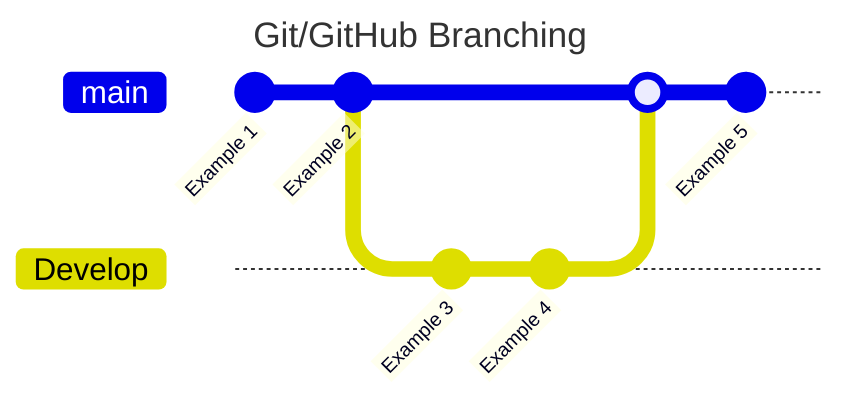
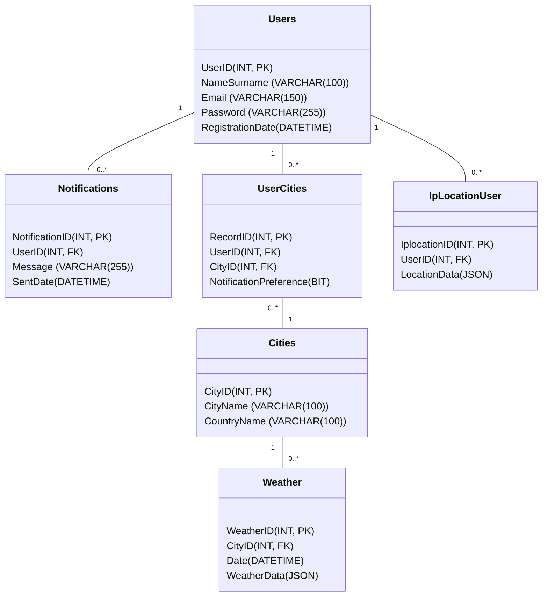

# Weather Plus Zero

> Simple and useful weather application in C#, suitable for Windows platforms.

## General 🙌

Weather Plus Zero is a modern and user-friendly weather application. Weather Plus Zero is a comprehensive weather application designed for Windows operating systems, developed using the C# programming language. It is designed to help users plan their daily lives.

## Features ⭐

**Main Features:**

- Instant weather information.
- Hourly and daily forecasts.
- Temperature, humidity, wind speed and direction.
- Visual weather indicators.
- Notification system.

**Technical Specifications:**

- Windows compatible modern interface.
- Fast and optimized performance.
- Real-time data updates.
- Low system resource utilization.

**Target Audience:**

- Daily weather tracking users.
- Professional planners.
- Outdoor activity enthusiasts.
- Weather dependent professionals.

**User Experience:**

The application is designed to be easy to use for users of all ages with its user-friendly interface and intuitive design. The minimal and modern design approach provides users with a seamless experience.

## What to Follow When Downloading the Project

If you clone this project directly, it may not work fully. For the application to work properly, you need to complete some configuration steps. In particular, you need to correctly add **API keys** that are critical to the project.

### Required API Keys and Configuration

The API keys needed for the application to run are stored in the `appsettings.json` file. These keys must be unique to you; otherwise the application will not work as expected.

Below you can see an example structure of the `appsettings.json` file:
```json
{
  "Authentication": {
    "Supabase_Url": "Your_Supabase_URL",
    "Supabase_Key": "Your_Supabse_KEY",
    "Supabase_Service_Role": "Your_Supabase_ROLE",

    "SendGrid_ApiKey": " Your_Twilio_SendGrid_API_KEY",

    "Weather_BaseUrl": "https://weather.visualcrossing.com/VisualCrossingWebServices/rest/services/timeline/{0}?key={1}&unitGroup=metric",
    "Weather_ApiKey": "Your_Visual_Crossing_API_KEY",

    "Ip_Api_Url": "http://ip-api.com/json"
  },

  "BackgroundImageURLs": {
    "clear-day-background": "https://img.freepik.com/free-photo/sun-flare_74190-1494.jpg",
    ...
  },

  "Logging": {
    "LogLevel": {
      "Default": "Information",
      "Microsoft.AspNetCore": "Warning"
    }
  },

  "AllowedHosts": "*"
}
```

### Data Storage and Encryption

Two different JSON files are created in the project:
1. `WeatherData.json`
    - Stores detailed weather data for the registered city.
    - Location:
      ```swift
      C:/Users/UserName/AppData/Local/WeatherZeroPlus/WeatherData.json
      ```
2. `ApplicationActivityData.json`
    - Keeps a record of the user's in-app activities.
    - Since it contains the user's e-mail and password, it is stored in encrypted form as a security measure.
    - Location:
      ```swift
      C:/Users/UserName/AppData/Local/WeatherZeroPlus/ApplicationActivityData.json
      ```
These files are used to personalize the app's user experience and securely manage session information.

#### Important Notes

- Do not share your API keys with anyone and do not add your `appsettings.json` file to version control (Git).
- If you enter the API keys incorrectly, the application may not work as expected.
- The contents of `ApplicationActivityData.json` are encrypted and cannot be read or accessed from outside.

## GitHub ⛓️‍💥

[Weather Plus Zero GitHub Repo](https://github.com/EnesEfeTokta/WeatherPlusZero)

## Drawio 🪢

[Weather Plus Zero Drawio](https://github.com/EnesEfeTokta/WeatherPlusZero/blob/main/WeatherPlusZero/Planning/WeatherPlusZero.drawio)

## Project Branching

The `main` branch is the main branch. It works and the latest codes are kept here. In the development process, the 'Develop' branch is used.



## Contact ☎️

- [enesefetokta009@gmail.com](mailto:enesefetokta009@gmail.com)
- (+90) 541 586 9564
- https://www.linkedin.com/in/enes-efe-tokta-6567151b5/
- https://github.com/EnesEfeTokta

## Logo and Visuals 🖼️


## Sources ➕

### Images

**User**

 


**Home**


**Email**


## Görevler 📝

[Görevler](https://www.notion.so/1531fb14c4a880c29cd1e8274f998d62?pvs=21)

## Project Planning and Design 🎨

The data to be displayed:

- Temperature (in Celsius),
- Nem,
- Wind,
- Precipitation

The number of cities to be monitored simultaneously can be up to three.

The notification system will stably notify you about the weather in the selected primary city every 5 hours. The notification includes basic information about the temperature and weather. In addition, the user will be able to customize the notification frequency.

The user interface is based on a simple design principle.  There is a UI element that shows the date and time, as well as a search bar that allows the user to find out the weather information of the cities by searching for the location. Temperature, pressure, humidity and wind data are displayed. It also has a timeline that will follow the sunset and sunrise of the user. It is used in a structure that lists the weather conditions in the coming days. There is a button for additional settings and account information for the user. With this button, the user will be able to access additional features.

## Technological Infrastructure Selection ☑️

LTS versions above .Net 6 or 7 were preferred for development. Because it was taken into consideration that future-oriented development and the possibility of encountering problems were low.

The UI Framework to be used was WPF. Being both modern and up-to-date will facilitate the development process.

OpenWeatherMap was preferred as the data source. Thus, we can access the data more economically and easily. If there is any contrary situation, we can use the Visual Crossing Weather tool.

## Technical Documentation 🧑‍💻

### API References

- **Visual Crossing Weather API:**
    - **Description:** Visual Crossing Weather API provides historical and forecast weather data for a given location.
    - **Basic URL:** https://weather.visualcrossing.com/VisualCrossingWebServices/rest/services/timeline/
    - **Endpoint:** /{city name}
    - **Data Format:** JSON
    - **Method:** GET
    - **Parameters Used:**
        - unitGroup (unit of measure - metric),
        - key (API key),
        - contentType (data type - json)

- Twilio SendGrid:**
    - **Description:** Twilio SendGrid provides email sending and management service.
    - **Basic URL:** https://api.sendgrid.com/v3/
    - **Endpoint:** mail/send
    - **Data Format:** JSON
    - **Method:** GET
    - **Data Format:** JSON
    - **Authentication:** API Key (Authorization: Bearer YOUR_API_KEY)
    - **Parameters (in JSON Body):**
        - personalizations: (Mandatory) Contains personalization details such as recipient information, subject.
        - to: (Mandatory) Contains recipient email address and name.
        - subject: (Required) Email subject.
        - from: (Mandatory) Sender email address and name.
        - content: (Required) Specifies the email content (plain text and/or HTML).

- **Supabase**
    - **Description:** Supabase is an open source Firebase alternative, offering features such as database, authentication, storage and real-time subscriptions.
    - **Basic URL:** YOUR_SUPABASE_URL
    - **Authentication:** API Key (apikey: YOUR_SUPABASE_ANON_KEY) and Bearer Token (if the user has a session)
    - **Examples by Features:**
        - **Database (PostgreSQL):**
            - **Description:** For inserting, querying, updating and deleting data.
            - **Endpoint:** /rest/v1/{table_name}
            - **Methods:** GET (Query), POST (Add), PATCH (Update), DELETE (Delete)

- **Ip-Api**
    - **Description:** Location information is received according to the user's IP.
    - **Basic URL:** http://ip-api.com/json
    - **Incoming Response Content** 
      - status: The status of the API request.
      - country: The country associated with the IP address.
      - countryCode: Country code (e.g. US, UK).
      - region: Region or state within the country.
      - regionName: The full name of the region.
      - city: The city associated with the IP address.
      - zip: Postal or zip code.
      - lat: Latitude coordinate.
      - lon: Longitude coordinate.
      - timezone: The time zone of the location.
      - isp: Internet Service Provider.
      - org: The organization associated with the IP.
      - as: Autonomous System number and organization.
      - query: Possibly the IP address being queried.

### Database

#### Scheme



#### Description

- **Users:** Table where user information is stored.
  - `UserID` (INT, PK): Unique ID of the user (Primary Key).
  - `NameSurname` (VARCHAR(100)): The user's first and last name.
  - `Email` (VARCHAR(150)): User's e-mail address.
  - `Password` (VARCHAR(255)): User's password.
  - `RegistrationDate` (DATETIME): User's registration date.

- **Notifications:** Table where notifications sent to users are stored.
  - `NotificationID` (INT, PK): Notification unique ID (Primary Key).
  - `UserID` (INT, FK): ID of the user who sent the notification (Foreign Key).
  - `Message` (VARCHAR(255)): Notification message.
  - `SentDate` (DATETIME): Notification sending date.

- **UserCities:** Table where the city information registered by users is stored.
  - `RecordID` (INT, PK): Record unique ID (Primary Key).
  - `UserID` (INT, FK): ID of the user who registered the city (Foreign Key).
  - `CityID` (INT, FK): ID of the city registered (Foreign Key).
  - `NotificationPreference` (BIT): Notification settings (On/Off).

- **Cities:** Table where the information of the cities is stored.
  - `CityID` (INT, PK): City unique ID (Primary Key).
  - `CityName` (VARCHAR(100)): City name.
  - `CountryName` (VARCHAR(100)): Name of the country with the city.

- **Weather:** Table that stores weather data for the city.
  - `WeatherID` (INT, PK): Data unique ID (Primary Key).
  - `CityID` (INT, FK): ID of the city to which the data belongs (Foreign Key).
  - `Date` (DATETIME): Date of data retrieval.
  - `WeatherData` (JSON): Weather data in the city.

- **IpLocationUser:** Table that stores the user's location data.
  - `IplocationID` (INT, PK): Data unique ID (Primary Key).
  - `UserID` (INT, FK): ID of the logged in user (Foreign Key).
  - `LocationData (JSON)` (JSON): Location data.

#### Relationships

- There is a *"one-to-many ”* relationship between `Users` and `Notifications` (a user can be sent multiple notifications).
- There is a *"one-to-many ”* relationship between `Users` and `UserCities` (a user can register multiple cities).
- There is a *"one-to-many ”* relationship between `Users` and `IpLocationUser` (a user can keep location data of multiple logged-in devices).
- There is a “many-to-one” relationship between `UserCities` and `Cities` (multiple users can register the same city).
- `Cities` and `Weather` have a *"one-to-many ”* relationship (there can be more than one weather record for a city).

### System Architecture

Layered architecture was preferred and used for the project.
- **Presentation Layer:** The user interface created with WPF. It manages user interactions and displays data.
- **Application Layer:** Manages business logic and application flow. Pulls data from the API, processes the data and passes it to the presentation layer.
- **Data Layer:** Manages API communication and access to data sources. It provides interaction with Supabase, SenGrid and Visual Crossing Weather APIs.

## **Safety and Performance 🛡️**

#### Security Protocols

- **Authentication:** Users can log in to their accounts with their approved e-mail and passwords.
- **Data Encryption:** The passwords set by the users are hashed and stored in a way that cannot be read and made meaningful by strangers.
- **Email Verification:** New users need to verify their accounts with the code sent to their e-mails.

#### Performance Optimization

- **Asynchronous Programming:** Long-running operations (API calls) are done asynchronously, preventing the UI from freezing.
- **Optimized UI:** Unnecessary UI drawings are avoided and UI elements that affect performance are used correctly.

### Resource Utilization
- Resource utilization of the application;
  - **CPU:** 0.1~0.4
  - **RAM:** 250~300MB
  - **Network:** 0.1~0.2MB/sec
  - **Disk:** 0.1~0.2MB/sec

## **User Documentation 📖**

#### User Manual

##### Interface Descriptions

- **Main Screen**
  - **Search Bar:** Used to search for weather information for a specific location.
  - **Date and Time:** Shows the current date and time.
  - **Location:** Shows the name of the currently displayed location.
  - **Temperature:** Shows the current temperature.
  - **Wind:** Shows the speed and direction of the wind.
  - **Humidity:** Shows the humidity in the air.
  - **Pressure:** Shows the atmospheric pressure.
  - **Day Cycle:** Shows the sunrise and sunset times.
  - **Daily Forecast:** Shows the weather forecast for the coming days.
  - **Main Weather Icon:** Indicates the weather occurring at that moment.
  - **Menu:** Click to open the menu.
- **Introduction Screen**
  - **User Profile Icon:** Represents the user profile of the application.
  - **Email Address Entry Field:** Used to enter your e-mail address.
  - **Email Address Validation Icon:** Indicates whether the entered email address is valid or not (Green tick valid, red cross invalid)
  - **Password Entry Field:** Used to enter your password.
  - **Password Verification Icon:** Indicates whether the entered password is correct or not. (Green tick is correct, red cross is incorrect)
  - **Forgot Password Link:** If you forgot your password, it redirects you to the password reset page.
  - **Log In Button:** If your login information is correct, it allows you to log in to the application.
  - **Become a Member Link:** If you do not have an account yet, it directs you to the membership page.

Description of #### Application Interface
- **Main Screen**
  - **Location Search:**
    - Type a city or region name in the search bar.
    - Select the correct location from the search results.
    - The app will display weather information for the selected location.
  - **Viewing Current Weather Information:**
    - The app automatically displays current temperature, wind, humidity and pressure information for the selected location.
    - The day cycle shows the sunrise and sunset times.
  - **View Daily Forecasts:**
    - The “Other Days” section shows weather forecasts for the coming days.
    - For each day, you can see the expected weather conditions (e.g. rain, sunny), the temperature range and an icon showing the general weather.
- **Introduction Screen**
  - **Email Address Entry:**
    - Enter a valid email address in the email address input field.
    - If the email address format is correct, a green check mark will appear next to it. Otherwise a red cross will appear.
  - **Password Entry:**
    - Enter your password in the password entry field.
    - If the password is correct, a green check mark will appear next to it. Otherwise a red cross will appear.
  - **Logging In:**
    - After entering your e-mail address and password correctly, click the *"Login ”* button.
    - If your login details are correct, you will be logged in to the application.
  - **Forgot Password:**
    - If you have forgotten your password, click on the *"Forgot Password ”* link.
    - Password reset instructions will be sent to your e-mail address.
  - **Becoming a Member:**
    - If you do not have an account yet, click on the *"Become a Member ”* link.
    - You can create a new account by filling out the membership form.
    
### FAQ (Frequently Asked Questions)

- **Question 1:** Which cities does the app show the weather for?
    - **Answer:** The app shows the weather for all cities accessible via the Visual Crossing Weather API.
- **Question 2:** How do notifications work?
    - **Answer:** Notifications are sent at set intervals (5 hours by default) for the user's selected primary city. The notification frequency can be changed in the settings menu.
- **Question 3:** How often are data updates done?
    - **Answer:** Data is pulled from the API every 5 hours. The application pulls the weather data from the JSON data it previously saved in the 5-hour period.
- **Question 4:** Does the application work without internet connection?
    - **Answer:** The app requires an internet connection to pull weather data. However, the cached data can be viewed without an internet connection.
- **Question 5:** How accurate is the data?
    - **Answer:** The app shows the weather for all cities accessible through the OpenWeatherMap and Visual Crossing Weather APIs. While these services are highly accurate for large and important cities, they can be inaccurate for smaller cities.
- **Question 6:** How many cities can we register?
    - **Answer:** The application allows you to register up to 3 cities.
- **Question 7:** Can we delete an account?
    - **Answer:** You can completely remove your account through the application. You will not have any stored data.
- **Question 8:** What should I do if I forgot my password?
    - **Answer:** You can change the password of your account through the application.
- **Question 9:** Are there certain rules for setting a password?
    - **Answer:** Yes, there are some rules that your password must follow when registering or entering the password. These rules are
      - Your password must be at least 8 characters.
      - Your password must contain at least two capital letters.
      - Your password must contain at least two numbers.
      - Your password must contain at least two special characters. *(For example: !, @, #, +, -, etc.)*

### Troubleshooting Guide

- **Problem 1:** The application won't open or crashes.
    - **Solution 1:** Restart the application. If the problem persists, reinstall the app.
- **Problem 2:** Weather data does not appear.
    - **Solution 2:** Check your internet connection. For developers, make sure the API key is correct.
- **Problem 3:** Notifications are not coming.
    - **Solution 3:** Check the notification settings. Make sure the app has notification permission.
- **Problem 4:** The app is running very slow.
    - **Solution 4:** Restart the app. Close other unnecessary applications.
- **Problem 5:** The verification code was not sent.
    - **Solution 5:** Try again or make sure that the e-mail address you entered is correct.
- **Problem 6:** The verification code does not work.
    - **Solution 6:** Send a code again. If it persists, restart the application or check that it has the latest version.
- **Problem 7:** My information is not loaded in the settings panel.
    - **Solution 7:** Close and open the app again or the probable cause is a weak internet network.

## **Quality Assurance ✨**

#### Test Scenarios

- **Functional Test Scenarios:** The application generally successfully fulfills its initial objectives.
- **Performance Test Scenarios:** The application has no problem serving multiple users per second.
- **Security Test Scenarios:** Data encryption, user login and e-mail verification are aimed to ensure user security in the application.
- **Usability Test Scenarios:** The application was directed according to the feedback of people both in the planning process and in the development process. Before the final version was released, a test of 50 (Fifty) people was presented to users and their feedback was taken into account.

### Error Reporting Procedures
- Users can report bugs to [**github issues**](https://www.google.com/url?sa=E&q=https%3A%2F%2Fgithub.com%2FEnesEfeTokta%2FWeatherPlusZero%2Fissues).
- Error reports should contain the following information:
    - Definition of error
    - Step/scenario where the error occurred
    - Error message if any
    - Screenshot

#### Quality Metrics

- **Error Rate:** The rate of errors in the application.
- **Test Coverage:** Proportion of lines of code tested.
- **Performance Metrics:** Response times, resource utilization, application startup time.
- **User Satisfaction:** User feedback and survey results.

## **Sürdürülebilirlik ve Bakım 🛠️**

#### Maintenance Plan
- **Periodic Updates:** Regular updates will be released for the app's performance, bugs and new features.
- **Technical Debt Management:** Regular technical debt management to maintain the quality of the code and facilitate future changes.
- **Dependency Updates:** Keeping the used libraries and APIs up to date.
- **Security Updates:** Quickly release updates against security vulnerabilities found.

#### Update Policy
- **Naming convention:** The naming convention is *(Major version).(Minor version).(Revision number).(Build number)*.
- **Major Updates:** Updates with new features or significant changes.
- **Minor Updates:** Updates with bug fixes and performance improvements.
- **Update Notifications:** Users will be notified via in-app notifications or email.

#### Support Procedures
- Support will be provided to users via email [**enesefetokta009@gmail.com**](https://www.google.com/url?sa=E&q=mailto%3Aenesefetokta009%40gmail.com).
- Frequently asked questions (FAQ) and troubleshooting guide will be kept up to date.
- Bug tracking and feedback will be received via GitHub repository.

## User Interface 🧮
- **Design Principles:** Modern, minimalist and user-friendly design.
- **Color Palette:** Possibility to switch between light and dark color themes.
- **Font Selection:** High readability fonts will be used.
- **Responsive Design:** Compatible display on different screen sizes and devices.
- **UI Elements:**
    - Search Bar
    - City Selection Buttons
    - Weather Information (Temperature, Humidity, Wind, Precipitation, etc.)
    - Hourly and Daily Forecast Lists
    - Notification Settings
    - Additional Settings and Account Information Button

## Legal and Regulatory Notices ⚠️

#### Privacy Policy
The privacy of your personal data is important to us. Therefore, we would like to transparently explain how we collect, use and protect your data:

**Data Collected:** Certain data may be collected during your use of the App. This data may include your location information, technical data about your device (e.g. operating system version, device model), usage habits and preferences. For a full list of the data we collect, visit [our Privacy Policy page](/PRIVACYPOLICY.md).

**Data Usage:** The collected data may be used to improve the functionality of the application, provide you with a better user experience, provide personalized content, troubleshoot bugs and perform analytics.

**Data Security:** Industry standard security measures are implemented to ensure the security of your personal data. However, please note that data transfers over the internet are not completely secure and we make every effort to protect your data against unauthorized access, but we cannot guarantee absolute security.

**Data Sharing:** Your personal data is not shared with third parties except for legal requirements or mandatory situations.

**Your rights:** You have the right to access, correct, delete or restrict our use of your personal data. For more information on how to exercise these rights, visit our [Privacy Policy page](/PRIVACYPOLICY.md).

### Terms of Use
By using our application you agree to the following terms of use:

**Use Limits:** You agree to use the Application lawfully and not to violate the rights of others.

**Intellectual Property:** All content in the application (texts, graphics, logos, icons, software, etc.) belongs to us or our licensees and is protected by intellectual property rights. There is no harm in using our content for purposes other than generating any economic income.

**Account Responsibility:** If you create an account on the application, you are responsible for maintaining the confidentiality of your account information.

**Changes:** Terms of use may be updated from time to time. Therefore, it is recommended to check it regularly.

**Termination:** If you violate the terms of use, your account may be suspended or terminated.

### Disclaimers
Our application provides weather information for general information purposes. While utmost care is taken to ensure the accuracy and up-to-dateness of this information, it is important for you to consider the following:

**No Warranty:** We do not make any guarantee that the weather information provided by the application is always accurate, complete and up-to-date. Weather forecasts can be inaccurate due to the complexity of atmospheric conditions.

**Limitation of Liability:** We cannot be held responsible for any direct or indirect damages (e.g. cancellation of your plans, financial losses, etc.) arising from your use of the application.

**Not a Substitute for Professional Advice:** The information provided by the app is not a substitute for advice from professional weather experts. It is recommended that you obtain information from reliable sources and experts before making critical decisions.

## Marketing & Promotion Strategies 🖊️
- **Social Media Marketing:** The features and benefits of the application will be promoted through social media platforms.
- **Blog Posts:** Blog posts will be published about the development process, features and usage areas of the application.
- **Promotional Videos:** Short promotional videos will be prepared to show the use of the application and explain its features.
- **Early Access Program:** An early access program will be created to test the application and get feedback.

## Developer Notes 🗒️
- **22/12/2024:** View Layer Created with XAML. Basic UI components have been created.
- **01/01/2025:** Added the ability to perform transactions with Supabase. Supabase integration for data storage and user management is completed.
- **06/01/2025:** Communication Established with Weather API. Integration with OpenWeatherMap API has been achieved and basic weather data can be obtained.
- **15/01/2025:** JSON Registration Completed. Application settings and user preferences are saved as JSON.
- **25/01/2025:** Improvements have been made regarding Supabase. Their codes became more readable and professional.
- **01/02/2025:** E-mail sending system was created.
- **02/02/2025:** User login system was built.
- **03/02/2025:** User registration system was created.
- **04/02/2025:** User password reset system has been made.
- **08/02/2025:** Daily weather e-mail sending system was created.

## Take Note 📢
Weather Zero Plus is the project of a second-year university student. Use it with this in mind.